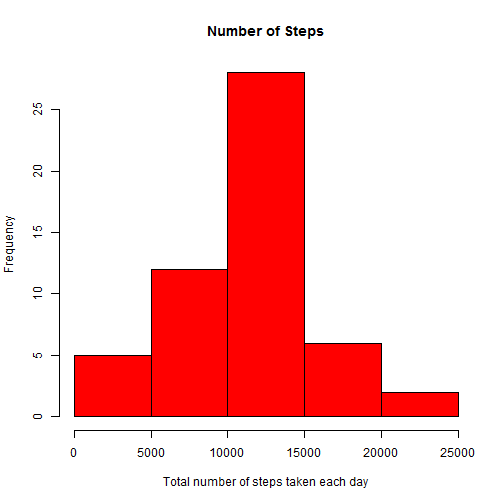
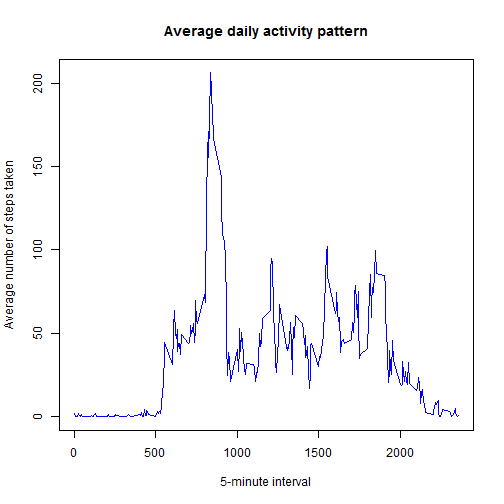
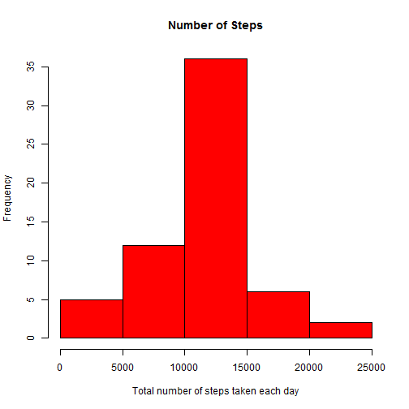

# Reproducible Research: Peer Assessment 1


## Introduction

This document describes the proedure to complete Coursera Reproducible Research: Peer Assessment 1. THe dataset is loaded from the file *activity.csv* located in the same folder as this document.

## Data Description


The variables in the dataset included in this dataset are:

* **steps**: Number of steps taking in a 5-minute interval (missing
    values are coded as `NA`)

* **date**: The date on which the measurement was taken in YYYY-MM-DD
    format

* **interval**: Identifier for the 5-minute interval in which
    measurement was taken
    

## Loading and preprocessing the data


```r
data <- read.csv("activity.csv", header=TRUE)
clean_data <- data[which(data$steps != "NA"), ]
```


## What is mean total number of steps taken per day?


```r
library(plyr)
total_by_day <- ddply(clean_data, .(date), summarise, steps=sum(steps))
hist(total_by_day$steps, main="Number of Steps", 
     xlab="Total number of steps taken each day", col="red")
```

 

```r
# mean and median total number of steps taken per day
mean(total_by_day$steps)
```

```
## [1] 10766
```

```r
median(total_by_day$steps)
```

```
## [1] 10765
```


## What is the average daily activity pattern?

To compute average daily activity pattern, the data is summarized over *period* field. Average steps taken per period is calculated as summary.  


```r
average_by_interval <- ddply(clean_data, .(interval), summarise, steps=mean(steps))
plot(average_by_interval$interval, average_by_interval$steps, type="l", 
     col="blue",
     xlab="5-minute interval", 
     ylab="Average number of steps taken",
     main="Average daily activity pattern")
```

 

```r
# Which 5-minute interval, on average across all the days in the dataset, contains the maximum number of steps?
average_by_interval[average_by_interval$steps==max(average_by_interval$steps),]
```

```
##     interval steps
## 104      835 206.2
```

```r
colnames(average_by_interval)[2] <- "intervalAvg"
```


## Imputing missing values

The input data set has a number of intervals with missing steps indicated by **NA**. We will impute these values with the average steps of the corresponding period, as calculated in Daily average activity pattern. This will be done using powerful intrinsics provided by data.table package.  


```r
# Total number of missing values in the dataset
sum(is.na(data$steps))
```

```
## [1] 2304
```

```r
# Fill NA's with average for that 5-min interval
merged <- arrange(join(data, average_by_interval), interval)
```

```
## Joining by: interval
```

```r
# Create a new dataset that is equal to the original dataset but with the missing data filled in.
merged$steps[is.na(merged$steps)] <- merged$intervalAvg[is.na(merged$steps)]
# Histogram
new_total_by_day <- ddply(merged, .(date), summarise, steps=sum(steps))
hist(new_total_by_day$steps, main="Number of Steps", 
     xlab="Total number of steps taken each day", col="red",)
```

 

```r
# mean and median total number of steps taken per day
mean(new_total_by_day$steps)
```

```
## [1] 10766
```

```r
median(new_total_by_day$steps)
```

```
## [1] 10766
```

```r
total_steps1 <- sum(clean_data$steps)
total_steps2 <- sum(merged$steps)
total_diff <- total_steps2 -total_steps1 []
```

Mean values didn't change, because I supplied interval averge for the given interval, so total average didn't change. Histogram and median changed somewhat. filling values added total of 8.613 &times; 10<sup>4</sup> steps.


## Are there differences in activity patterns between weekdays and weekends?

Yes. From the chart below, you can see weekday steps are higher during the morning hours, but daytime weekend steps are more than that of weekday.


```r
library(lattice)
weekdays <- weekdays(as.Date(merged$date))
data_with_weekdays <- transform(merged, day=weekdays)
data_with_weekdays$wk <- ifelse(data_with_weekdays$day %in% c("Saturday", "Sunday"),"weekend", "weekday")
average_by_interval_wk <- ddply(data_with_weekdays, .(interval, wk), summarise, steps=mean(steps))

xyplot(steps ~ interval | wk, data = average_by_interval_wk, layout = c(1, 2), type="l")
```

 
